# Chronos: Asistente personal inteligente Chronos: Evolución de un asistente personal inteligente con integración de servicios en la nube, procesamiento de voz y gestión proactiva de tareas

## 🧠 Chatbot Multilingüe con n8n, Telegram, IA Generativa y Google Calendar

Este proyecto consiste en el desarrollo de un **asistente de productividad** que utiliza Inteligencia Artificial para la comprensión profunda del lenguaje natural. Implementado en **n8n**, permite una interacción humana, fluida y multilingüe a través de **Telegram**, integrando capacidades de gestión de agenda, tareas, procesamiento de voz y notificaciones proactivas.

El bot gestiona eventos en **Google Calendar** (crear, ver, modificar y eliminar) y consulta información meteorológica mediante la **API de OpenWeather**, interpretando las peticiones del usuario.

---

### 🧩 Flujo actual del proyecto

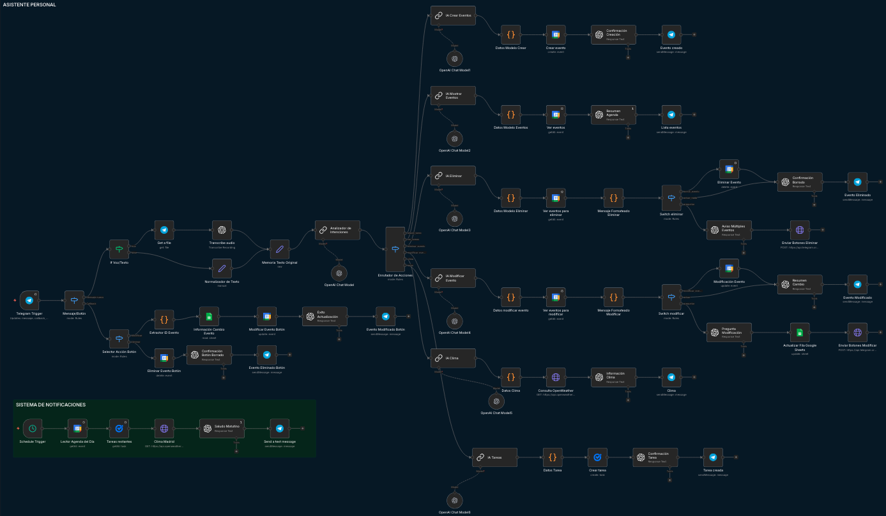

---

El flujo se compone de los siguientes elementos clave:

1. **Entrada Multicanal (Telegram Trigger)**: Recibe mensajes de texto o archivos de voz enviados por el usuario.
2. **Capa de Transcripción (OpenAI Whisper)**: Si la entrada es un audio, el sistema descarga el archivo y utiliza **Whisper** para convertir el mensaje en texto con alta precisión.
3. **Analizador de Intenciones (GPT-4o-mini)**: Un modelo de NLP clasifica la petición en categorías: *Crear, Ver, Eliminar, Modificar, Clima o Tarea*.
4. **Procesamiento Inteligente de Datos**: Nodos de IA extraen fechas, horas y descripciones. 
5. **Integración con Google Workspace**:
   - **Google Calendar**: Gestión de eventos.
   - **Google Tasks**: Registro de tareas.
6. **Sistema Proactivo (Schedule Trigger)**: Un flujo independiente se activa a una hora programada para enviar un resumen matutino con la agenda, las tareas y el clima actual.
7. **Respuestas Naturales y Multilingües**: El bot responde en el idioma original del usuario, con mensajes dinámicos y formateados.

---

### 🚀 Funcionalidades implementadas

- **Gestión de Voz y Texto**: Procesamiento dual mediante Whisper y GPT.
- **Soporte Multilingüe Dinámico**: El bot detecta y responde en el idioma del usuario automáticamente.
- **Gestión Completa de Calendario**: Operaciones CRUD inteligentes.
- **Gestión de Tareas**: Inserción rápida en Google Tasks.
- **Notificaciones Proactivas**: Resumen diario automatizado para comenzar el día.

---

### 🛠️ Tecnologías utilizadas

- [**n8n**][n8nurl] – Orquestador de flujos de trabajo.
- [**OpenAI GPT-4o-mini**][openaiurl] – Motor de IA para clasificación de intenciones, extracción de datos y redacción de respuestas.
- [**OpenAI Whisper**][whisperurl] – Modelo de inteligencia artificial para transcripción de audio.
- [**Google Tasks API**][googletasksurl] – Gestión de listas de tareas pendientes.
- [**Telegram Bot**][telegramboturl] – Interfaz de usuario.
- [**Google Calendar API**][googlecalendarurl] – Gestión de agenda. 
- [**OpenWeather API**][openweatherurl] – Datos meteorológicos.

[n8nurl]: https://n8n.io/
[openaiurl]: https://openai.com/
[whisperurl]: https://openai.com/index/whisper/
[googletasksurl]: https://developers.google.com/tasks
[telegramboturl]: https://core.telegram.org/bots
[googlecalendarurl]: https://developers.google.com/workspace/calendar
[openweatherurl]: https://openweathermap.org/api

---

### 📋 Ejemplos de uso

#### 🗓️ Evento creado en Google Calendar
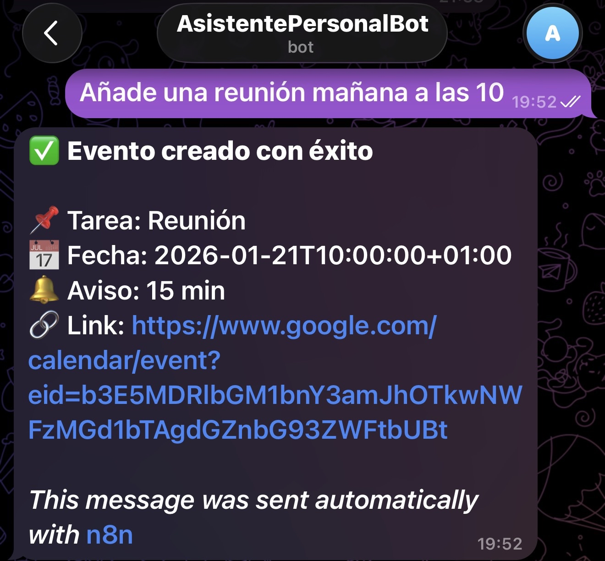

#### 📅 Lista de eventos
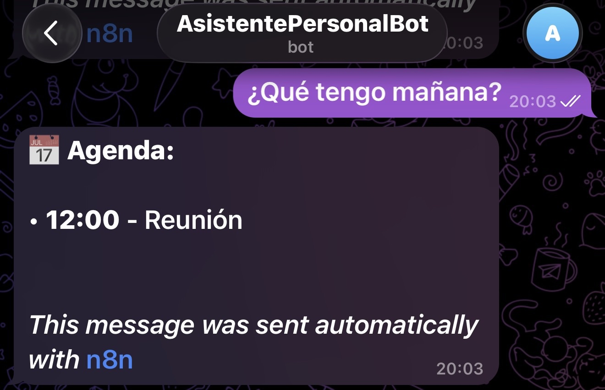

#### 🧭 Google Calendar
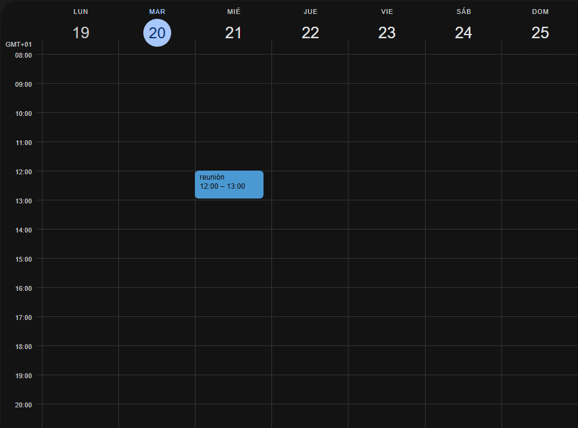

#### ✏️ Modificar evento
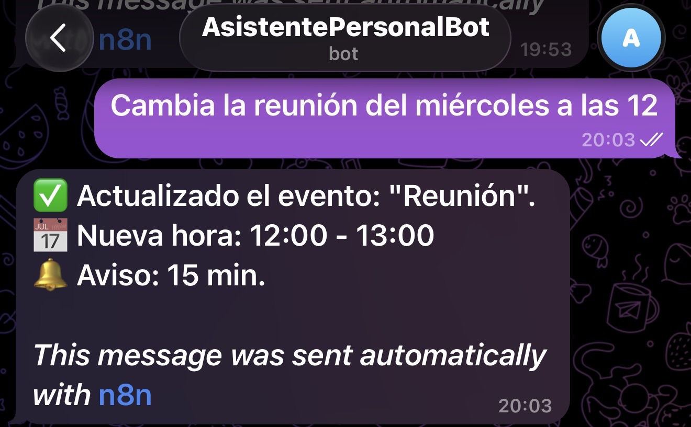

#### 🗑 Eliminar evento
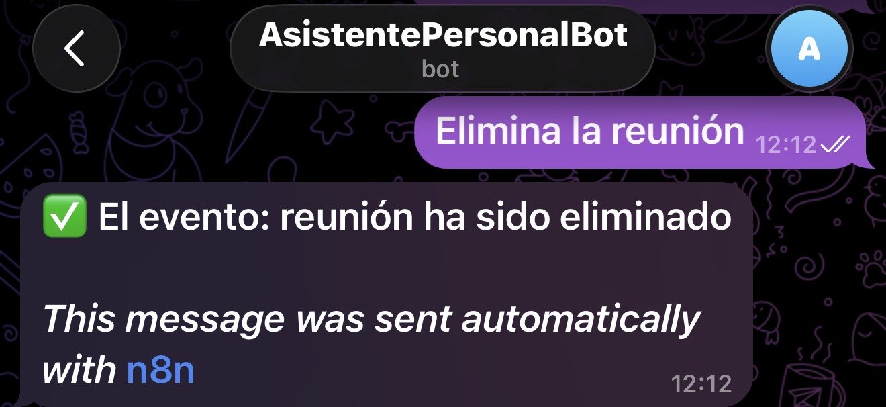

#### 📋 Lista de eventos repetidos para eliminar
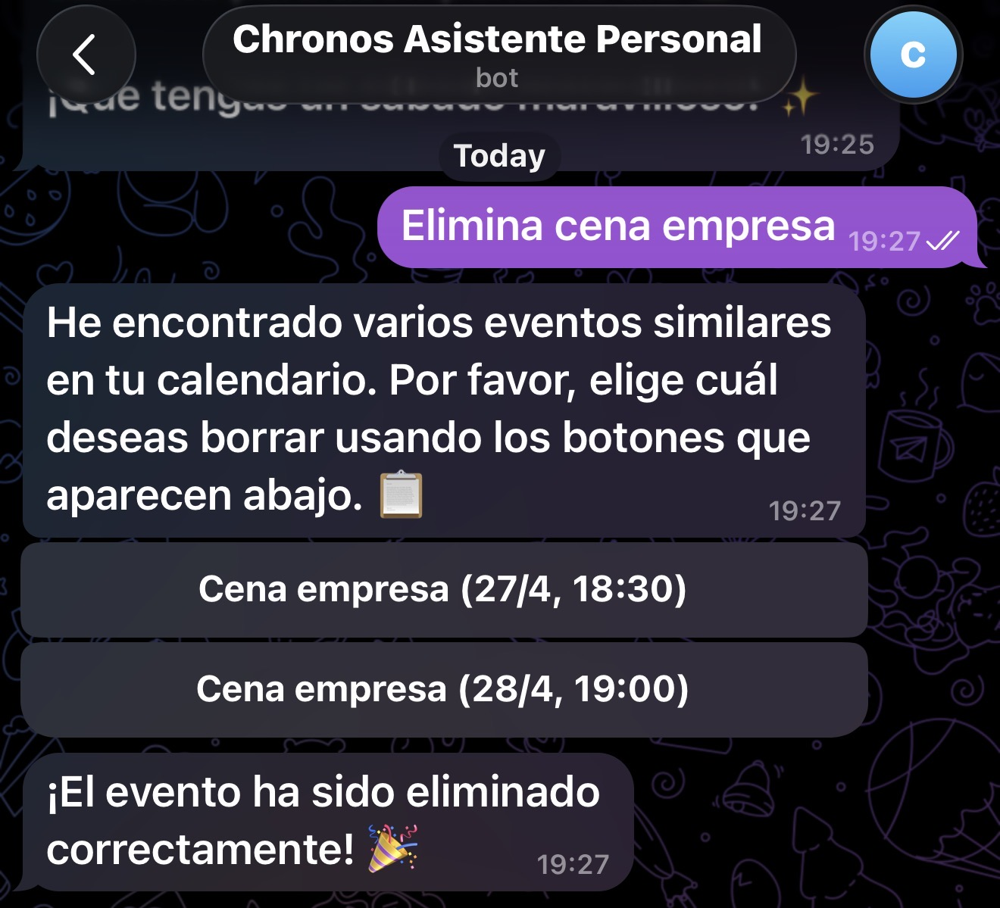

#### ☀️ Muestra de datos del clima
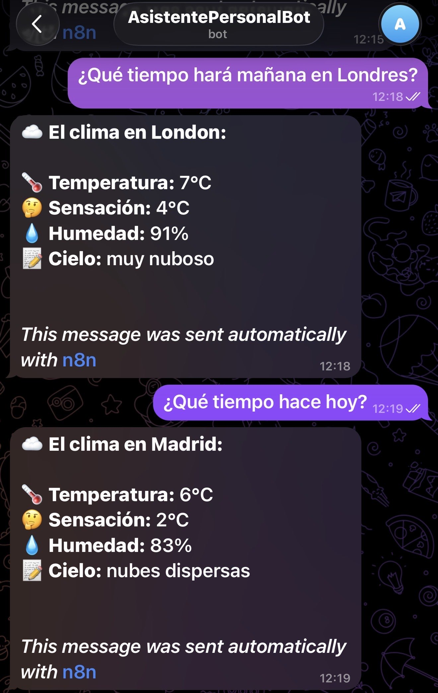

#### 🎙️ Interacción por Voz
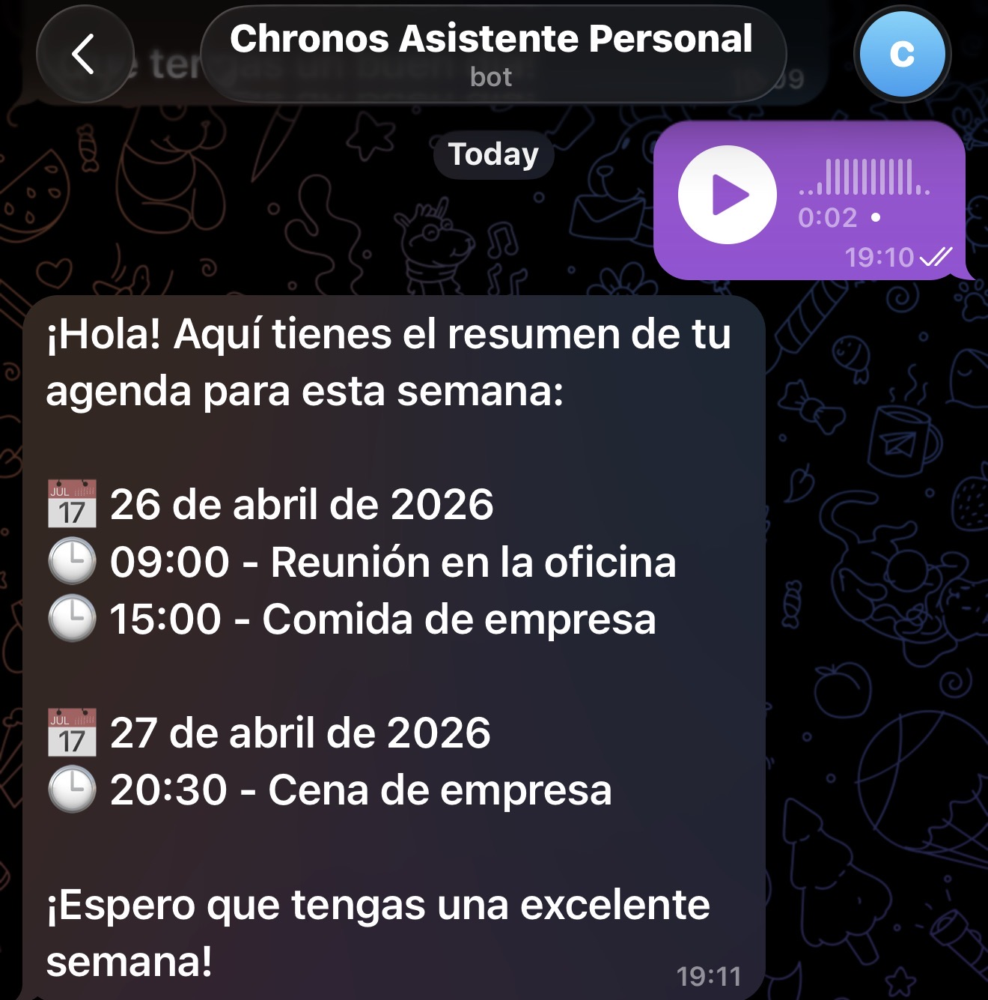

#### 📝 Gestión de Google Tasks

#### ☀️ Resumen Matutino Proactivo
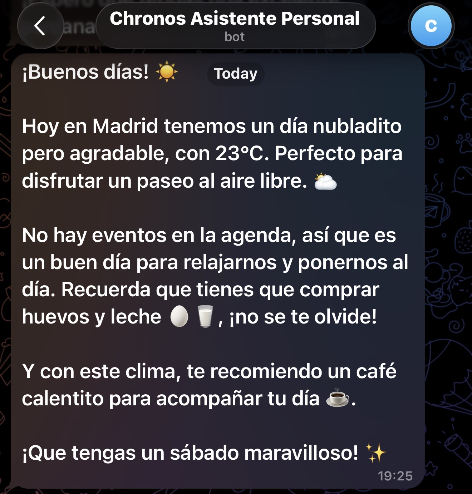

#### 🌍 Interacción Multilingüe
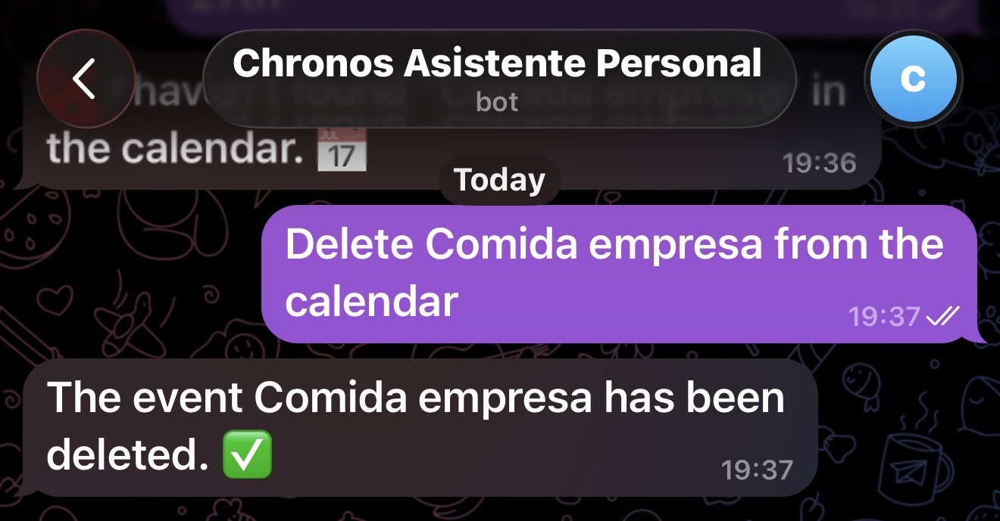
---
